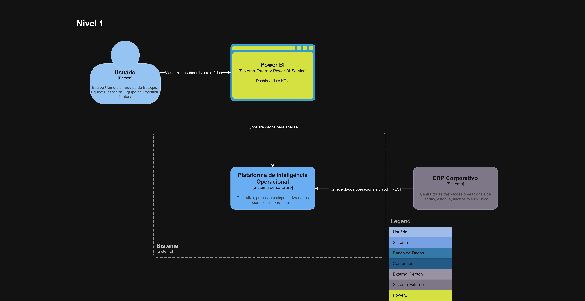

# C4 - Nível 1: Diagrama de Contexto

## Descrição

Este diagrama apresenta a Plataforma de Inteligência Operacional no contexto dos usuários e sistemas externos da empresa VendaMais.

O objetivo é demonstrar como o sistema se integra ao ERP corporativo e à ferramenta de visualização Power BI, além de evidenciar os atores que consomem as informações.

## Diagrama

## Atores

- Usuários (Comercial, Financeiro, Logística, Diretoria): responsáveis por visualizar dashboards e indicadores.
  
## Sistemas Externos

- ERP Corporativo: sistema responsável por fornecer os dados operacionais.
- Power BI: ferramenta utilizada para visualização dos dados analíticos.

## Relações

- Usuário → Power BI: visualiza dashboards e relatórios.
- Power BI → Plataforma de Inteligência Operacional: consulta dados analíticos (SQL / DirectQuery).
- ERP Corporativo → Plataforma de Inteligência Operacional: fornece dados operacionais via API REST.

## Considerações

A plataforma atua como o núcleo central da solução, sendo responsável por integrar, processar e disponibilizar os dados para consumo analítico.
