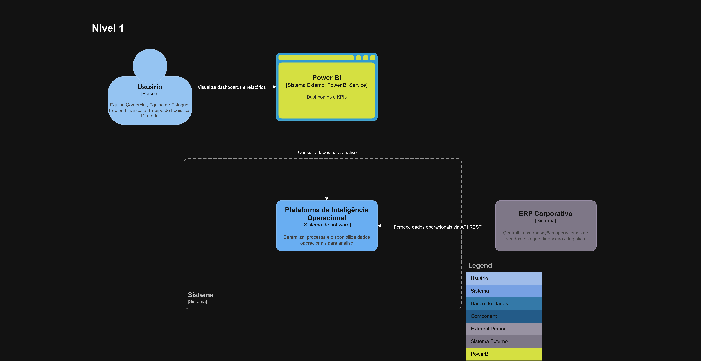

# C4 - Nível 2: Diagrama de Containers

## Descrição

Este diagrama apresenta a decomposição da Plataforma de Inteligência Operacional em seus principais containers, detalhando tecnologias, responsabilidades e comunicação entre os componentes.

## Diagrama

## Containers

### Azure Function - Ingestão
Responsável por extrair os dados do ERP corporativo diariamente por meio de requisições HTTP.

### Azure Blob Storage
Responsável pelo armazenamento dos dados brutos (raw) e processados (curated), garantindo rastreabilidade e histórico.

### Azure Function - Transformação
Responsável por processar os dados extraídos, aplicando regras de negócio e limpeza.

### Azure SQL Database
Responsável por armazenar os dados estruturados e servir como fonte para consultas analíticas.

## Sistemas Externos

- ERP Corporativo: fornece dados operacionais via API REST.
- Power BI: consome dados para geração de dashboards.
- Usuários: acessam os dashboards através do Power BI.

## Comunicação entre containers

- ERP → Azure Function (Ingestão): fornece dados via API REST (JSON).
- Azure Function (Ingestão) → Blob Storage: armazena dados brutos.
- Blob Storage → Azure Function (Transformação): leitura de dados para processamento.
- Azure Function (Transformação) → Azure SQL Database: grava dados tratados.
- Power BI → Azure SQL Database: consulta dados via SQL (DirectQuery).
- Usuário → Power BI: visualiza dashboards e relatórios.

## Considerações

A arquitetura segue o padrão de pipeline de dados (ingestão → armazenamento → transformação → consumo), garantindo escalabilidade, organização e separação de responsabilidades entre os componentes.